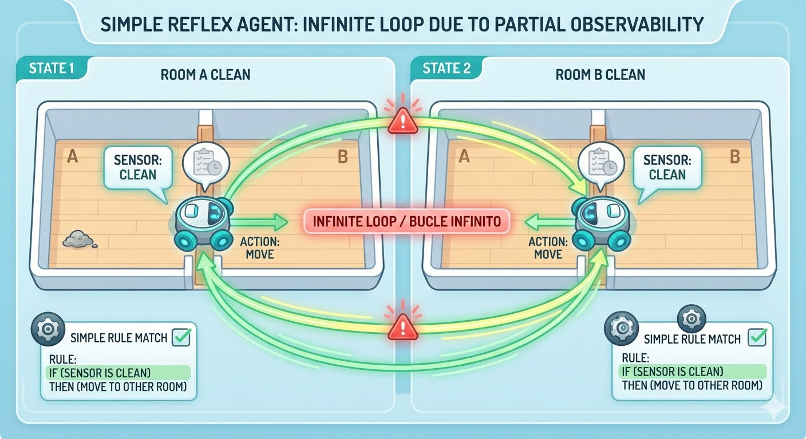

## Simple-Reflex Agents

Los agentes de reflejo simple seleccionan acciones basándose exclusivamente 
en la percepción actual mediante reglas de condición-acción, 
prescindiendo del historial de percepciones.

" lanza una moneda cuando está confundido "

practicamnete la unica solucion para salir del bucle es una funcion que añada
aleatoriedad cuando haya "confusion", no pueda resolver el  **Estado de ambigüedad.**

-   Paso 1: Limpia la Habitación A. Su estado interno actualiza el mapa: *"Habitación A está limpia"*.
-   Paso 2: Se mueve a la Habitación B y ve que está limpia.
-   **El momento de la verdad**: un agente simple, se confunde y regresará a la A. 