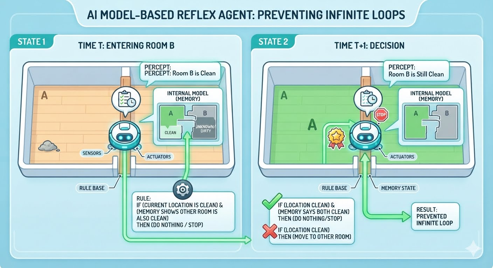

El Agente de Reflejo Basado en Modelos (*Model-Based Reflex Agent*)
es la evolución directa del agente de reflejo simple.

Su objetivo principal es resolver el problema de la "ceguera" 
(la observabilidad parcial).

Mientras que el agente simple solo vive en el presente absoluto, 
el agente basado en modelos utiliza memoria para mantener un estado interno

----
**EL MODELO:** _informacion que manipula_  +

Estado Interno=

- **Cómo evoluciona el mundo por sí mismo:** 
 Por ejemplo, si un auto va delante de mí y frena, sus luces se encenderán
y su velocidad disminuirá en los siguientes segundos.
El mundo cambia aunque yo no haga nada.
   
   
- **Cómo afectan las propias acciones del agente al mundo:** 
Por ejemplo, si giro el volante a la derecha, el mundo a la izquierda 
desaparecerá de mi cámara porque me he movido.

