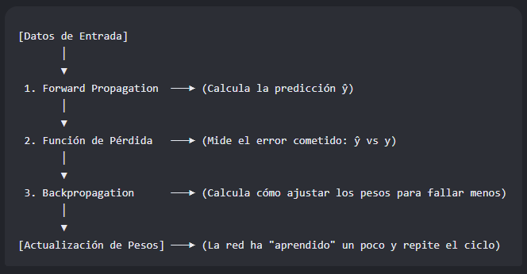

# Propagacion y Retropropagacion:

El tema de la propagación no es solo un componente aislado, sino que representa el motor dinámico 
y el flujo de información de todo el sistema.

Si el Perceptrón Simple que revisamos antes es la "anatomía" (la estructura fija), 
la propagación es la "fisiología" (el movimiento y el aprendizaje).

Enfocando el tema de redes neuronales como un esquema semantico tenemos:

Esquema Semántico de Redes Neuronales Artificiales

* **1. Arquitectura Estructural (Componentes Estáticos)**
    * **Capas (*Layers*):** Entrada, Ocultas y Salida.
    * **Unidades de Procesamiento:** Neuronas / Perceptrones.
    * **Parámetros:** Pesos ($\mathbf{w}$) y Sesgos ($b$).

* **2. Dinámica de Operación (Flujo de Información) $\leftarrow$ ¡Aquí está la Propagación!**
    * **Propagación hacia Adelante (*Forward Propagation*):**
        * **Función:** Transportar la información desde la entrada hasta la salida.
        * **Proceso:** Realiza los cálculos que acabas de revisar ($z = \mathbf{w}^T \mathbf{x} + b$) capa por capa y aplica las funciones de activación para generar una predicción ($\hat{y}$).
    * **Propagación hacia Atrás (*Backpropagation*):**
        * **Función:** Calcular cómo afectan los pesos de la red al error final para poder corregirlos.
        * **Proceso:** Viaja en sentido inverso (desde la salida hacia la entrada) aplicando la **Regla de la Cadena** del cálculo para obtener las derivadas del error respecto a cada peso.

* **3. Mecanismo de Optimización (El Aprendizaje)**
    * **Función de Pérdida (*Loss Function*):** Mide numéricamente qué tan lejos estuvo la predicción ($\hat{y}$) del valor real ($y$).
    * **Algoritmo de Optimización:** Gradiente Descendiente (*Gradient Descent*), que utiliza las matemáticas obtenidas en la *Backpropagation* para actualizar los pesos ($\mathbf{w}$) y reducir el error.

---
**_La propagación_** ocupa el lugar del Ciclo de Ejecución y Aprendizaje. Una red neuronal no puede aprender sin cumplir estrictamente este bucle interactivo continuo:

**Forward propagation** es la fase donde la red "piensa" y da una respuesta.

**Backpropagation** es la fase de "autocrítica" donde la red analiza sus errores 
para mejorar en el siguiente intento.

